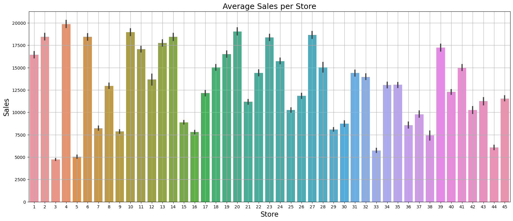

# Sales-Forecasting

This project demonstrates the application of various machine learning techniques for sales forecasting. By leveraging historical sales data from Walmart, we aim to predict future sales accurately. The project involves data preprocessing, exploratory data analysis, feature engineering, and the implementation of multiple regression models to identify the most effective approach for sales prediction.

# Project Overview
Sales forecasting is crucial for businesses to manage inventory, plan production, and strategize marketing efforts. Accurate sales predictions help companies optimize resources and make informed decisions. In this project, we use historical sales data provided by Walmart to forecast future sales. The dataset includes information on store sales, features, and store-specific characteristics.

## Dataset Description

The following tables describe the structure of each dataset used in this project. Understanding the fields within each dataset is crucial for comprehending the data preprocessing steps and the subsequent analysis. These tables provide a detailed overview of the available features and their descriptions, helping you to understand how the data is organized and what each field represents.

### `train.csv`
| Field Name     | Description                                                          |
|----------------|----------------------------------------------------------------------|
| `Store`        | The ID of the store.                                                 |
| `Dept`         | The department within the store.                                     |
| `Date`         | The week of sales.                                                   |
| `Weekly_Sales` | The weekly sales for the given store and department.                 |
| `IsHoliday`    | Whether the week is a special holiday week (1) or not (0).           |

### `stores.csv`
| Field Name     | Description                                                          |
|----------------|----------------------------------------------------------------------|
| `Store`        | The ID of the store.                                                 |
| `Type`         | The type of the store (e.g., A, B, C).                               |
| `Size`         | The size of the store in square feet.                                |

### `features.csv`
| Field Name     | Description                                                          |
|----------------|----------------------------------------------------------------------|
| `Store`        | The ID of the store.                                                 |
| `Date`         | The week of sales.                                                   |
| `Temperature`  | The average temperature in the region for that week.                 |
| `Fuel_Price`   | The cost of fuel in the region for that week.                        |
| `MarkDown1`    | Data related to promotional markdowns. (optional, can be null)       |
| `MarkDown2`    | Data related to promotional markdowns. (optional, can be null)       |
| `MarkDown3`    | Data related to promotional markdowns. (optional, can be null)       |
| `MarkDown4`    | Data related to promotional markdowns. (optional, can be null)       |
| `MarkDown5`    | Data related to promotional markdowns. (optional, can be null)       |
| `CPI`          | The Consumer Price Index.                                            |
| `Unemployment` | The unemployment rate.                                               |
| `IsHoliday`    | Whether the week is a special holiday week (1) or not (0).           |

### `test.csv`
| Field Name     | Description                                                          |
|----------------|----------------------------------------------------------------------|
| `Store`        | The ID of the store.                                                 |
| `Dept`         | The department within the store.                                     |
| `Date`         | The week of sales.                                                   |
| `IsHoliday`    | Whether the week is a special holiday week (1) or not (0).           |


## Project Aim

The primary aim of this project is to develop an accurate and reliable sales forecasting model using machine learning techniques. By leveraging historical sales data from Walmart, the project seeks to predict future sales, which is crucial for effective inventory management, production planning, and strategic decision-making. The specific objectives of the project include:

1. **Data Preprocessing**: Cleaning and preparing the data to ensure it is suitable for analysis and model training. This involves handling missing values, encoding categorical variables, and scaling numerical features.

2. **Exploratory Data Analysis (EDA)**: Analyzing the data to uncover patterns, trends, and insights that can inform the feature engineering process and model selection.

3. **Feature Engineering**: Creating and selecting meaningful features that capture the underlying patterns in the data and improve the model's predictive performance.

4. **Model Development**: Implementing and comparing various machine learning models, including Linear Regression, Random Forest Regressor, K-Nearest Neighbors Regressor, and XGBoost Regressor, to identify the best-performing model for sales forecasting.

5. **Model Evaluation**: Assessing the performance of the models using appropriate evaluation metrics, such as Mean Absolute Error (MAE), Mean Squared Error (MSE), and R-squared, to ensure the accuracy and reliability of the predictions.

6. **Model Selection**: Selecting the most effective model based on its performance and using it to generate future sales forecasts.

By achieving these objectives, the project aims to provide a robust sales forecasting solution that can help businesses optimize their operations and make data-driven decisions.

## Tasks and Code

### Task 1: Import Libraries
First, we import all the necessary libraries for data manipulation, visualization, and machine learning.

```python
import numpy as np
import pandas as pd
import matplotlib.pyplot as plt
import seaborn as sns
from scipy import stats
import statsmodels.api as sm
from sklearn.preprocessing import MinMaxScaler
from sklearn import metrics
from sklearn.model_selection import train_test_split
from sklearn.linear_model import LinearRegression
from sklearn.ensemble import RandomForestRegressor
from sklearn.neighbors import KNeighborsRegressor
from xgboost import XGBRegressor
```
### Task 2: Load the Data
Load the datasets train.csv, stores.csv, and features.csv.

```python
data = pd.read_csv('train.csv')
stores = pd.read_csv('stores.csv')
features = pd.read_csv('features.csv')
```

### Task 3: Data Preprocessing
Handle missing values, and other data oreprocessing operations.

```python
# Filling missing values
features['CPI'].fillna(features['CPI'].median(),inplace=True)
features['Unemployment'].fillna(features['Unemployment'].median(),inplace=True)

# Encoding categorical variables
data = pd.get_dummies(data, columns=['IsHoliday'])
features = pd.get_dummies(features, columns=['IsHoliday'])
stores = pd.get_dummies(stores, columns=['Type'])

# Scaling numerical features
scaler = MinMaxScaler()
data[['Weekly_Sales']] = scaler.fit_transform(data[['Weekly_Sales']])
features[['Temperature', 'Fuel_Price', 'MarkDown1', 'MarkDown2', 'MarkDown3', 'MarkDown4', 'MarkDown5', 'CPI', 'Unemployment']] = scaler.fit_transform(features[['Temperature', 'Fuel_Price', 'MarkDown1', 'MarkDown2', 'MarkDown3', 'MarkDown4', 'MarkDown5', 'CPI', 'Unemployment']])

#Outlier Detection
agg_data = data.groupby(['Store', 'Dept']).Weekly_Sales.agg(['max', 'min', 'mean', 'median', 'std']).reset_index()

# Aggregate and drop
data['Total_MarkDown'] = data['MarkDown1']+data['MarkDown2']+data['MarkDown3']+data['MarkDown4']+data['MarkDown5']
data.drop(['MarkDown1','MarkDown2','MarkDown3','MarkDown4','MarkDown5'], axis = 1,inplace=True)
```

### Task 4: Exploratory Data Analysis (EDA)
Visualize sales trends and analyze the impact of various features on sales.

```python
#Average Monthly Sales
plt.figure(figsize=(14,8))
sns.barplot(x='Month',y='Weekly_Sales',data=data)
plt.ylabel('Sales',fontsize=14)
plt.xlabel('Months',fontsize=14)
plt.title('Average Monthly Sales',fontsize=16)
plt.savefig('avg_monthly_sales.png')
plt.grid()
```
 

```python
#Average Weekly Sales Store wise
plt.figure(figsize=(20,8))
sns.barplot(x='Store',y='Weekly_Sales',data=data)
plt.grid()
plt.title('Average Sales per Store', fontsize=18)
plt.ylabel('Sales', fontsize=16)
plt.xlabel('Store', fontsize=16)
plt.savefig('avg_sales_store.png')
plt.show()
```


```python
# Average sales per department
plt.figure(figsize=(20,8))
sns.barplot(x='Dept',y='Weekly_Sales',data=data)
plt.grid()
plt.title('Average Sales per Department', fontsize=18)
plt.ylabel('Sales', fontsize=16)
plt.xlabel('Department', fon
tsize=16)
plt.savefig('avg_sales_dept.png')
plt.show()
```
 

```python
# Effect of Temperature on Sales
plt.figure(figsize=(10,8))
sns.distplot(data['Temperature'])
plt.title('Effect of Temperature',fontsize=15)
plt.xlabel('Temperature',fontsize=14)
plt.ylabel('Density',fontsize=14)
plt.savefig('effect_of_temp.png')
plt.show()
```
 

```python
# Holiday Distribution
plt.figure(figsize=(8,8))
plt.pie(data['IsHoliday'].value_counts(),labels=['No Holiday','Holiday'],autopct='%0.2f%%')
plt.title("Pie chart distribution",fontsize=14)
plt.legend()
plt.savefig('holiday_distribution.png')
plt.show()
```
 

```python
plt.figure(figsize=(15,8))
corr = data[num_col].corr()
sns.heatmap(corr,vmax=1.0,annot=True)
plt.title('Correlation Matrix',fontsize=16)
plt.savefig('correlation_matrix.png')
plt.show()
```
 

### Task 5: Feature Engineering
Create new features and select important ones for model training.

```python
# Creating new features
data['Year'] = pd.DatetimeIndex(data['Date']).year
data['Month'] = pd.DatetimeIndex(data['Date']).month
data['Week'] = pd.DatetimeIndex(data['Date']).week

# Selecting important features
features = data[['Store', 'Dept', 'Date', 'Temperature', 'Fuel_Price', 'CPI', 'Unemployment', 'IsHoliday_0', 'IsHoliday_1']]
```

### Task 6: Model Implementation
Split the data into training and testing sets and train multiple regression models.

```python
# Splitting the data
X = features.drop(['Weekly_Sales'], axis=1)
y = features['Weekly_Sales']
X_train, X_test, y_train, y_test = train_test_split(X, y, test_size=0.2, random_state=42)

# Linear Regression
lr = LinearRegression()
lr.fit(X_train, y_train)
lr_pred = lr.predict(X_test)
```
 

```python
# Random Forest Regressor
rf = RandomForestRegressor(n_estimators=100, random_state=42)
rf.fit(X_train, y_train)
rf_pred = rf.predict(X_test)
```
 

```python
# K-Nearest Neighbors Regressor
knn = KNeighborsRegressor(n_neighbors=5)
knn.fit(X_train, y_train)
knn_pred = knn.predict(X_test)
```
 

```python
# XGBoost Regressor
xgb = XGBRegressor(n_estimators=100, random_state=42)
xgb.fit(X_train, y_train)
xgb_pred = xgb.predict(X_test)
```
 

### Task 7: Model Evaluation
Evaluate model performance using metrics such as Mean Absolute Error (MAE), Mean Squared Error (MSE), and R-squared.

```python
# Evaluating models
def evaluate_model(y_test, y_pred, model_name):
    mae = metrics.mean_absolute_error(y_test, y_pred)
    mse = metrics.mean_squared_error(y_test, y_pred)
    r2 = metrics.r2_score(y_test, y_pred)
    print(f"{model_name} Performance:")
    print(f"MAE: {mae}")
    print(f"MSE: {mse}")
    print(f"R2 Score: {r2}")
    print("")

evaluate_model(y_test, lr_pred, "Linear Regression")
evaluate_model(y_test, rf_pred, "Random Forest Regressor")
evaluate_model(y_test, knn_pred, "K-Nearest Neighbors Regressor")
evaluate_model(y_test, xgb_pred, "XGBoost Regressor")
```
 

## 🛠 Skills Used
Python, Data Cleaning, Data Preprocessing, Data Visualization, Exploratory Data Analysis, Feature Engineering, 

Missing Value Imputation, Categorical Encoding, Scaling, Outlier Detection, Regression Models, Model Comparison, 

Linear Regression, Random Forest Regressor, K-Nearest Neighbors Regressor, XGBoost Regressor, Model Evaluation, 

Mean Absolute Error, Mean Squared Error, R-squared

## 🚀 About Me
Hi 👋, I'm Ahmed Munir

A dedicated Artificial Inteligence Specialist

💬 Ask me about AI, ML, DL

📫 How to reach me ahnather2@gmail.com

## 🔗 Links
[](https://www.linkedin.com/in/ahmed-munir-4b8749269/)
